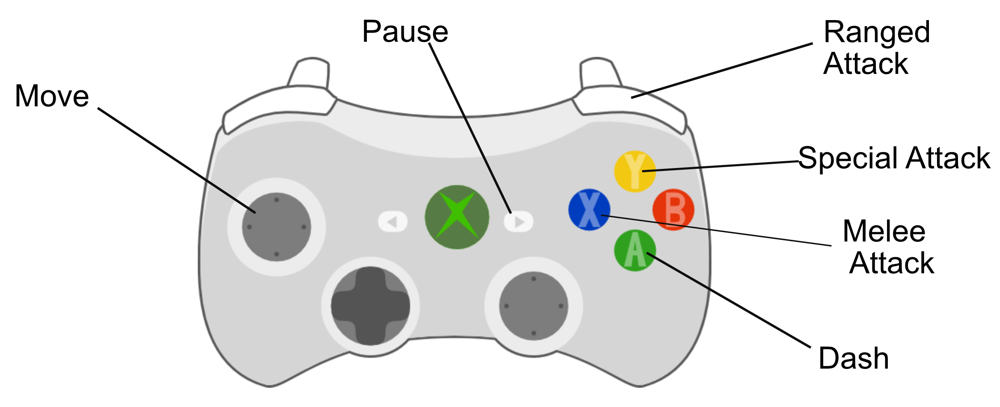

# CurseOfImmortality

Curse of Immortality is a rogue-lite dungeon crawler in which the player must face various challenges in an arena. The player fights for the survival of humanity as it finds itself in a power struggle between the most powerful forces in the cosmos.
The game has responsive controller controls and fast-paced, mechanically challenging real-time combat. Additionally, there are options to customize the arena fighter by strengthening his attacks with modular upgrades, allowing for unique builds.

The project was created during one semester at University for Media (HdM) in Stuttgart.
Latest Build was created in Unreal Engine Version 5.0.3

## Preview

## Controls

## Credits
**Sven Walter**  
Animations, 3D Characters, VFX, Programming (Combat System), 2D Art 

**Fabio Mangiameli**  
Programming (Enemy AI and Environment)

**Marc Becklein**  
Programming (Character)

**Judith Rothacker**  
3D Environment, UI Programming

**Heike Bahr**  
3D Environment

**Michael Dmoch**  
Sound Design

**Ann-Christin Schwerdtfeger**  
Music
